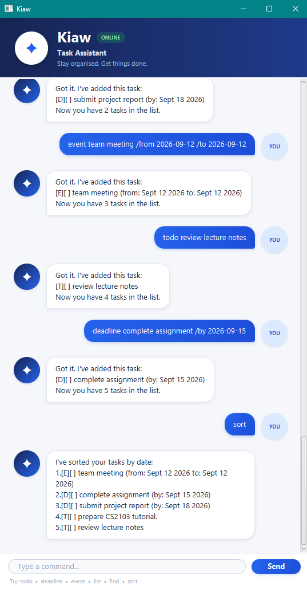

# Kiaw User Guide

Kiaw is a desktop task assistant that helps you keep track of todos, deadlines,
and events using simple text commands.



## Quick Start

Type a command into the input box at the bottom of the window and press
**Enter** or click **Send**.

For commands that use dates, enter dates in the following format:

`yyyy-MM-dd`

For example:

`2026-09-18`

## Command Summary

| Action | Command |
|---|---|
| Add a todo | `todo DESCRIPTION` |
| Add a deadline | `deadline DESCRIPTION /by DATE` |
| Add an event | `event DESCRIPTION /from DATE /to DATE` |
| List all tasks | `list` |
| Find tasks | `find KEYWORD` |
| Sort tasks by date | `sort` |
| Mark a task as done | `mark TASK_NUMBER` |
| Mark a task as not done | `unmark TASK_NUMBER` |
| Delete a task | `delete TASK_NUMBER` |
| Exit Kiaw | `bye` |

## Adding a Todo

Use `todo` to add a task that does not have a specific date.

**Format:**

`todo DESCRIPTION`

**Example:**

`todo review lecture notes`

Kiaw adds the todo to your task list.

## Adding a Deadline

Use `deadline` for a task that must be completed by a particular date.

**Format:**

`deadline DESCRIPTION /by DATE`

**Example:**

`deadline submit project report /by 2026-09-18`

Kiaw displays the deadline in a more readable date format after adding it.

## Adding an Event

Use `event` for an activity that takes place between a start and end date.

**Format:**

`event DESCRIPTION /from DATE /to DATE`

**Example:**

`event team meeting /from 2026-09-12 /to 2026-09-12`

The end date cannot be earlier than the start date.

## Listing Tasks

Use `list` to display all your current tasks.

**Command:**

`list`

Each task is shown with its type and completion status.

For example:

```text
1.[D][ ] submit project report (by: Sep 18 2026)
2.[T][X] review lecture notes
```

The task types are:

- `T` — Todo
- `D` — Deadline
- `E` — Event

`X` indicates that a task has been completed.

## Finding Tasks

Use `find` to search task descriptions for a keyword.

**Format:**

`find KEYWORD`

**Example:**

`find report`

Kiaw displays tasks whose descriptions contain the given keyword.

## Sorting Tasks

Use `sort` to arrange your tasks chronologically.

**Command:**

`sort`

Deadlines are sorted using their due dates, while events are sorted using
their start dates. Todos do not have dates, so they are placed after all
dated tasks.

For example:

```text
I've sorted your tasks by date:
1.[E][ ] team meeting (from: Sep 12 2026 to: Sep 12 2026)
2.[D][ ] complete assignment (by: Sep 15 2026)
3.[D][ ] submit project report (by: Sep 18 2026)
4.[T][ ] prepare CS2103 tutorial
5.[T][ ] review lecture notes
```

Tasks with the same sorting date retain their existing relative order.

The sorted order is saved automatically and remains after Kiaw is restarted.

## Marking a Task as Done

Use `mark` with the task number shown by `list`.

**Format:**

`mark TASK_NUMBER`

**Example:**

`mark 2`

Kiaw marks task 2 as completed.

## Marking a Task as Not Done

Use `unmark` to change a completed task back to incomplete.

**Format:**

`unmark TASK_NUMBER`

**Example:**

`unmark 2`

## Deleting a Task

Use `delete` with the number of the task you want to remove.

**Format:**

`delete TASK_NUMBER`

**Example:**

`delete 3`

Task numbers may change after a task is deleted, so use `list` again if
needed.

## Exiting Kiaw

Use:

`bye`

Kiaw displays a farewell message and closes the application.

## Invalid Commands

If a command is incomplete or invalid, Kiaw displays an error message instead
of terminating unexpectedly.

For example:

`deadline submit report /by Friday`

Kiaw will explain that the date should use the `yyyy-MM-dd` format.

If you are unsure of a task number, use `list` before using `mark`, `unmark`,
or `delete`.

## Saving Your Tasks

Kiaw saves changes to your task list automatically.

Your tasks are loaded again the next time Kiaw starts, so you do not need to
save them manually.
